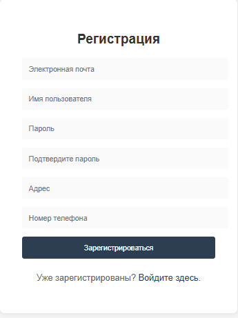
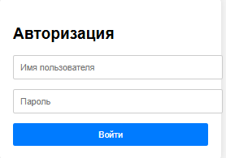

# Магазин странных вещей
## Описание
Учебный проект сайта, созданный на фреймворке django, имитирующий работу интернет магазина.
## Возможности сайта
- Регистрация
- Логин
- Список товаров
- Просмотр товаров по отдельности
## Чему я научился
- Создание схемы базы данных и её реализация.
- Статические файлы.
- Язык CSS и его подключение к HTML-документам.
- Создание полей для картинок в базе данных через ORM.
- Настройка хранения статических файлов в проекте.
- Регистрация пользователя и возможность изменения данных с
помощью встроенных классов.
## Работа сайта
### Список товаров

### Товары отдельно

### Регистрация

### Логин
